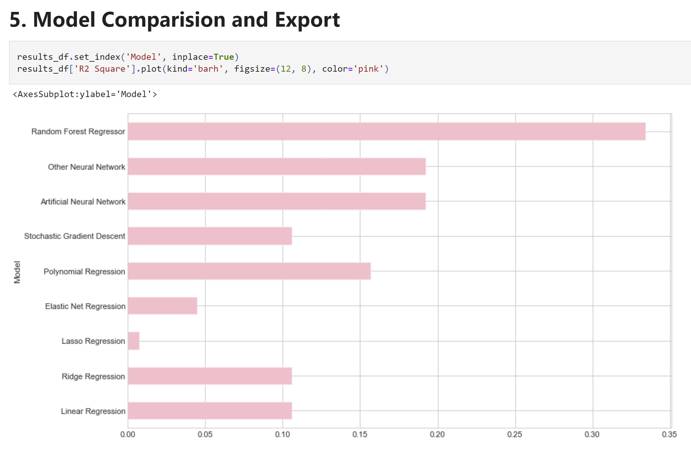

# Severity Prediction Linear Regression
Comprehensive data preparation, exploration, visualization, feature engineering, and regression modeling for a case study: 
Predict severity level of car accidents in the USA from 2016-2020 using regression models.




# Data
This is a countrywide car accident dataset, which covers 49 states of the USA. 
The accident data are collected from February 2016 to Dec 2020, using multiple APIs that provide streaming traffic incident (or event) data.


# Objective
+ recognize key factors affecting the accident severity
+ Create ML model that can accurately predict accident severity
+ Identify the patterns of how these severe accidents happen and the key factors affecting vehicle accident severity levels in the US and provide the most accurate prediction model.
+ Might implement well-informed actions and better allocate financial and human resources.
+ Might be able to predict the severity of the accident based on the data.
+ 
+ Cleam and Understand the cause and effect of the accidents
+ Building several machine learning regression models that can help forecast future accidents.
+ Predict severity level of car accidents in the USA from 2016-2020 using regression models.

# Target variable
Severity (Univariate variable)

# Problem Type
Regression (predict value of severity)


# Metric:
MAE
MSE
RMSE
R2

# Key Findings:
> The maximum number of accidents have taken place at around 4-5P.M, and a relatively high has taken place from 7–8 AM. This can result from the rush hour that most people come to and back to work, school, and home.

> The state has the most accidents in California (28%), followed by Florida(10%) in the USA (2016-2020).

> The density of points is more at the eastern and western coasts than in the middle of the country, indicating that more accidents were recorded at the two sides from February 2016 to Dec 2020 in the Contiguous United States rather than its middle part.

> The graph shows the accident is more or less proportional to the severity

> The accidents with a severity level of 4 have the longest distance.
The longer the distance, the more severe the accidents

> Fatal accidents occurred near a traffic signal, junction and crossing were present. The driver might fail to pay attention before pulling out due to impatience, impairment of one form or another, or a simple failure to judge the distance and speed of an oncoming vehicle.

> The most common weather condition is Fair, followed by Mostly Cloudy and Overcast.

> Surprisingly, significantly higher accident cases were recorded from September to November, but the more severe impact on traffic happens around February to May.

> The best model I get overall is Random Forest Regressor  with the lowest RMSE value on the test dataset


# Application
+ Having a model prototype that can be deployed in production that further predict severe accidents in real-time in the US.
+ Studying accident hotspot locations; casualty analysis (extracting cause and effect rules to predict accidents);
+ The impact of precipitation or other environmental stimuli on accident occurrence.
+ Urban planning and improving transportation infrastructures.
+ Provide officials with suggestions to take adequate measures with higher precision to lessen accident impacts and improve road safety.
+ US-Accidents can be used for numerous applications such as real-time car accident prediction,
  studying car accidents hotspot locations, casualty analysis and extracting cause and effect rules to predict car accidents,
  and studying the impact of precipitation or other environmental stimuli on accident occurrence.
  The most recent release of the dataset can also be useful to study the impact of COVID-19 on traffic behavior and accidents.


## Future improvement:
+ I would like to try out more stacking and ensemble methods to improve the model.


# WORKING ON YOUR LOCAL COMPUTER

python version 3.8.8

1. Install Conda
   by [following these instructions](https://conda.io/projects/conda/en/latest/user-guide/install/index.html). Add Conda
   binaries to your system `PATH`, so you can use the `conda` command on your terminal.

2. Install jupyter lab and jupyter notebook on your terminal

+ `pip install jupyterlab`
+ `pip install jupyter notebook`

### Jupyter Lab

1. Download the 3879312 zipped project folder. Unzip it by double-clicking on it.

2. In the terminal, navigate to the directory containing the project and install these packages and libraries

```
pip install -r requirements.txt
```

3. Enter the newly created directory using `cd directory-name` and start the Jupyter Lab.

```
jupyter lab

```

You can now access Jupyter's web interface by clicking the link that shows up on the terminal or by
visiting http://localhost:8888 on your browser.

4. Click on assignment2.ipynb in the browser tab. This will open up my main file in the Jupyter Lab.

### Note: If the Jupyter Notebook is not responding due to many requests

Error [(The page is not responding)](https://stackoverflow.com/questions/48615535/jupyter-notebook-takes-forever-to-open-and-then-pages-unresponsive-mathjax-i)

I had to restart the notebook; and it did not work. This is because I was printing out too much and the following
scripts resolved the issue by clear out all the output to run through the whole kernal:

1. `conda install -c conda-forge nbstripout` or `pip install nbstripout`

2. `nbstripout filename.ipynb`
